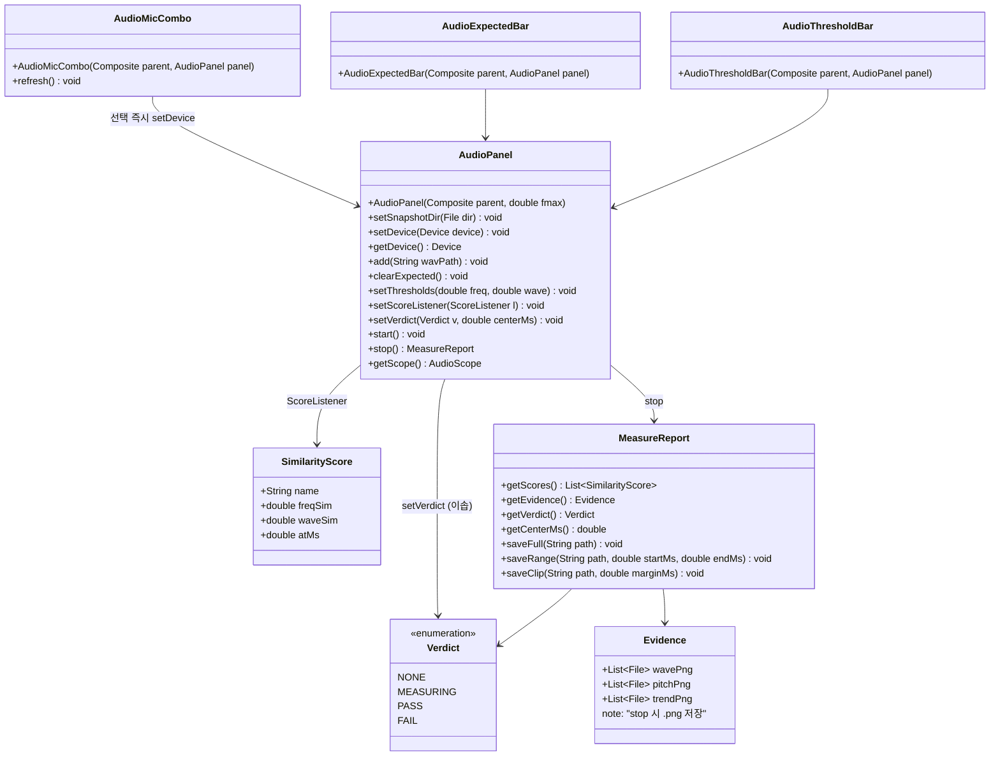
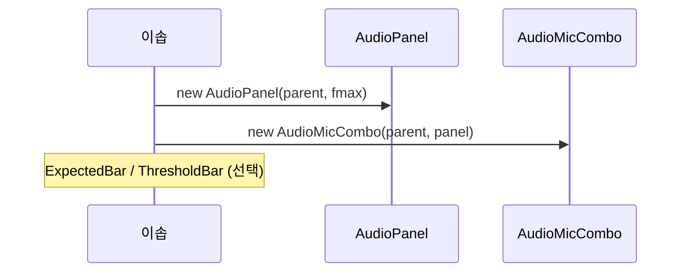
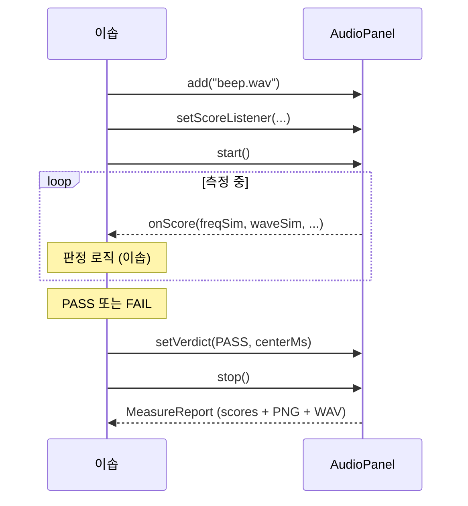

# 음향 검증 모듈 - 클라이언트(이솝) API 설계

기대 beep **유사도 계산** + 모니터 / 녹음 / PNG 증거를 RCP/SWT에서 재사용하기 위한 컴포넌트.

> Notion: [R158 음향 검측 모듈 설계](https://www.notion.so/suresofttech/R158-3a6bd7ce447180dd9347f5e6cbbf9efd)

**경계 (후방 `Verdict`와 동일)**
| 주체 | 책임 |
|---|---|
| **모듈** | 유사도(`freqSim`/`waveSim`) 계산 / 그래프 / 녹음 / stop 시 PNG |
| **이솝** | **PASS/FAIL 판정** / 판정 상태 / 시각을 모듈에 전달 / TC/DB/UX |

**이솝 최소 흐름**
1. Panel + 필요한 Bar/Combo 배치
2. `add` → `start`
3. 유사도 수신 → **이솝이 PASS/FAIL 결정** → `setVerdict(...)`
4. `stop` → PNG / WAV 확보

---

## 1. 구성 요소 (객체)

| 객체 | 역할 | 계층 |
|---|---|---|
| `AudioPanel` | 진입점. UI는 Scope(그래프)만. 세션 / 장치 / 기대음 상태 소유 | ui.widget |
| `AudioMicCombo` | (선택) 마이크 선택 UI → `panel.setDevice` | ui.widget |
| `AudioExpectedBar` | (선택) 기대음 경로 UI → `panel.add` / `clearExpected` | ui.widget |
| `AudioThresholdBar` | (선택) 기준선 UI → `panel.setThresholds` | ui.widget |
| `AudioScope` | 파형/주파수/추이 (Panel 내부) | ui.widget |
| `SimilarityScore` | 기대음 1건의 유사도 값 (판정 아님) | core 또는 ui |
| `Verdict` | `NONE` / `MEASURING` / `PASS` / `FAIL` - **이솝이 설정** | core |
| `MeasureReport` | `stop()` 반환. 점수 / PNG / WAV (PASS 여부 없음) | ui |
| `Evidence` | 스냅샷 **PNG 파일** 묶음 | ui.widget |

> **위임**: Combo/Bar는 UI만. 상태는 전부 `AudioPanel`. 이솝은 Combo 없이 `setDevice`/`add`/`setThresholds` 직접 호출 가능.
> **시작/정지 UI 없음** - 이솝이 `panel.start`/`stop` 호출. 내부 Capture/Matcher 등은 비공개.

---

## 2. 클래스 다이어그램



<details>
<summary>API 설계 목록 (이솝 공개)</summary>

#### `AudioPanel` (ui) - 진입점
| API | 설명 |
|---|---|
| `AudioPanel(Composite parent, double fmax)` | 패널 배치 |
| `setSnapshotDir(File dir)` | PNG 저장 폴더 |
| `setDevice(Device device)` / `getDevice()` | 입력 장치 상태. `start()` 시 사용 |
| `add(String wavPath)` | 기대음 WAV 경로 등록 (유사도 대상) |
| `clearExpected()` | 기대음 해제 |
| `setThresholds(double freq, double wave)` | 추이 그래프 **기준선** (모듈 판정용 아님) |
| `setScoreListener(ScoreListener l)` | 블록마다 유사도 통지 → **이솝이 판정** |
| `setVerdict(Verdict v, double centerMs)` | 이솝이 내린 판정 / 시각 전달 (스냅샷 중심 등) |
| `start()` / `stop()` | 측정 시작 / 종료→`MeasureReport` |
| `getScope()` | 모니터 |

**인자 의미**
- `device`: 입력 장치. 미설정 시 기본 장치
- `wavPath`: 기대음 `.wav` (모듈이 load)
- `freq`/`wave`: 그래프 기준선 (0~1)
- `ScoreListener`: `void onScore(List<SimilarityScore> scores)`
- `centerMs`: 판정 시각(ms). 스냅샷 / 클립 중심

#### `SimilarityScore` - 유사도 값 (판정 아님)
| 필드 | 설명 |
|---|---|
| `name` | 기대음 식별 (경로 또는 등록명) |
| `freqSim` / `waveSim` | 유사도 0~1 |
| `atMs` | 해당 점수 시각(ms) |

#### `Verdict` - 이솝이 설정
| 값 | 설명 |
|---|---|
| `NONE` / `MEASURING` | 미판정 / 측정 중 |
| `PASS` / `FAIL` | 이솝 최종 판정 |

#### 선택 UI - Panel에 위임만
> 후방 ControlBar/PresetCombo → Canvas와 동일. **상태 / 세션은 Panel.**

| 위젯 | 공개 API | Panel 호출 | 설명 |
|---|---|---|---|
| `AudioMicCombo` | `(parent, panel)`, `refresh()` | 선택 → `setDevice` | 입력 장치 목록 콤보. 목록 조회 / 표시는 위젯 내부. 이솝은 Capture 미사용 |
| `AudioExpectedBar` | `(parent, panel)` | `add` / `clearExpected` | 기대음 WAV 경로 / 파일선택 UI |
| `AudioThresholdBar` | `(parent, panel)` | `setThresholds` | freq/wave 그래프 기준선 / 참고 임계 UI |

- 설정 View 등 배치 가능 (`AudioPanel` 참조만).
- 측정 중 `setDevice`는 다음 `start`부터 적용.

#### `MeasureReport` - `stop()` 결과
| API | 설명 |
|---|---|
| `getScores()` | 측정 중 유사도(최종/요약). **PASS 여부 없음** |
| `getVerdict()` / `getCenterMs()` | 이솝이 `setVerdict`로 넣은 값 |
| `getEvidence()` | stop 시 저장한 **PNG** (`centerMs` 기준, 미설정 시 종료 시각) |
| `saveFull` / `saveRange` / `saveClip` | WAV 저장 (`saveClip`=center±margin) |

#### `Evidence` - PNG
| API | 설명 |
|---|---|
| `wavePng` / `pitchPng` / `trendPng` | `.png` `File` 리스트 (전3 / 중심 / 후3) |

**규약**: `.png` 고정. `stop()` 때 저장. SWT Image 반환 없음.

</details>

---

## 3. 사용자 시나리오

### S1. 화면 배치
| 단계 | 동작 | API |
|---|---|---|
| 1 | 패널 | `new AudioPanel` |
| 2a | (선택) 마이크 콤보 | `new AudioMicCombo(parent, panel)` |
| 2b | (선택) 기대음 경로 UI | `new AudioExpectedBar` |
| 2c | (선택) 임계 UI | `new AudioThresholdBar` |



---

### S2. 측정 → 유사도 → 이솝 판정 → 종료
| 단계 | 동작 | API |
|---|---|---|
| 1 | 장치 / 기대음 / 기준선 | (MicCombo→)`setDevice` / `add` / `setThresholds` |
| 2 | 리스너 | `setScoreListener` |
| 3 | 시작 | `start()` |
| 4 | 유사도 수신 | `onScore(scores)` - **모듈은 점수만** |
| 5 | 판정 | 이솝 로직 → `setVerdict(PASS\|FAIL, centerMs)` |
| 6 | 종료 | `stop()` → PNG / WAV |



**규약**
1. 모듈 = 유사도만. **PASS/FAIL은 이솝**
2. Combo/Bar = UI 위임만. 장치 / 기대음 / 임계 상태는 `AudioPanel`
3. `setVerdict`로 판정 / 시각을 넘겨야 스냅샷 중심 / 클립이 맞음
4. 스냅샷 = `stop()` 때 PNG. 시작/정지 UI 없음
5. TC/DB/UX = 이솝

---

## 4. 사용자 Action 목록

| Action | 주체 | API | 결과 |
|---|---|---|---|
| 패널 / 컨트롤 배치 | 이솝 | `AudioPanel` / MicCombo / ExpectedBar / ThresholdBar | 화면 |
| 마이크 선택 | 사용자 | MicCombo → `setDevice` | Panel 장치 상태 |
| 기대음 입력 | 사용자 | ExpectedBar → `add` / `clearExpected` | Panel 기대음 |
| 임계치 선택 | 사용자 | ThresholdBar → `setThresholds` | Panel 기준선 |
| 측정 시작/종료 | 이솝 | `panel.start()` / `stop()` | `MeasureReport` |
| 유사도 수신 | 모듈→이솝 | `ScoreListener` | `SimilarityScore` |
| **PASS/FAIL 판정** | **이솝** | (이솝 코드) | 판정 |
| 판정 전달 | 이솝 | `setVerdict(v, centerMs)` | 스냅샷 중심 등 |
| PNG / WAV | 이솝 | `MeasureReport` | 보고서 |

---

## 5. 패키지 활용법

```java
AudioPanel panel = new AudioPanel(parent, 5000);

new AudioMicCombo(toolbar, panel);       // 마이크 선택 (설정 View 가능)
new AudioExpectedBar(row1, panel);       // 기대음 경로 (선택)
new AudioThresholdBar(row2, panel);      // 기준선 / 참고

panel.setSnapshotDir(new File("out/snap"));
panel.add("expected/beep.wav");

panel.setScoreListener(scores -> {
    if (esopJudgePass(scores)) {
        panel.setVerdict(Verdict.PASS, nowMs);
    }
});

panel.start();   // 이솝 UI에서 호출 (MicCombo로 고른 장치 사용)
// ...
MeasureReport r = panel.stop();
Evidence e = r.getEvidence();
r.saveFull("out/full.wav");
```

---

## 화면설계 구상

1. **AudioPanel** - Scope + 세션 (판정 / 시작/정지 UI 없음)
2. **AudioMicCombo** - 마이크(입력 장치) 선택
3. **AudioExpectedBar** - 기대음 경로 / 파일선택 (설정 View 가능)
4. **AudioThresholdBar** - 기준선 / 참고 임계
5. **이솝** - 시작/정지 버튼, 유사도→PASS/FAIL, TC/DB, UX, 보고서

---

## 구현 현황 (참고)

| 항목 | 상태 |
|---|---|
| Scope / Capture / Recorder / Matcher / WavIo | PoC (저수준) |
| PoC `AudioView` micCombo | PoC (인라인) |
| Panel / MicCombo / Bars / ScoreListener / setVerdict / PNG | **설계** |
