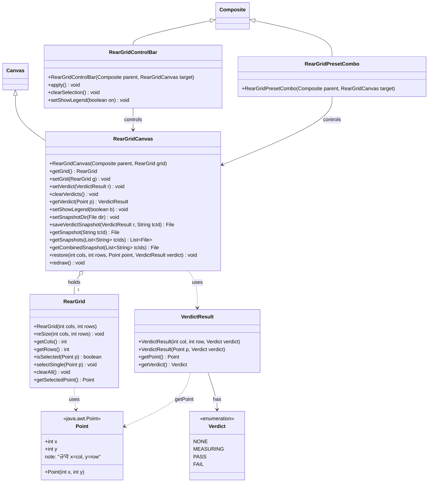
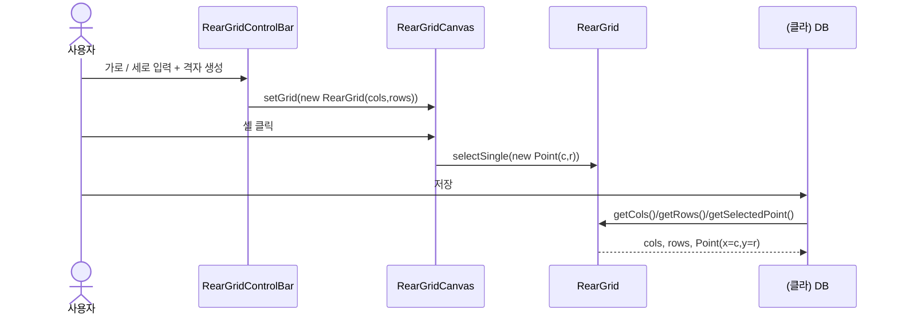
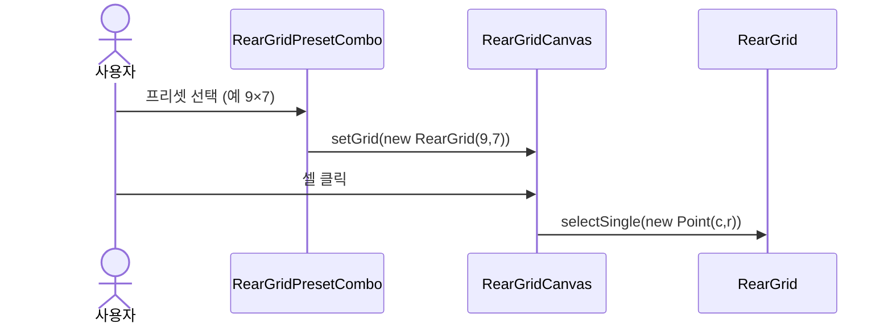
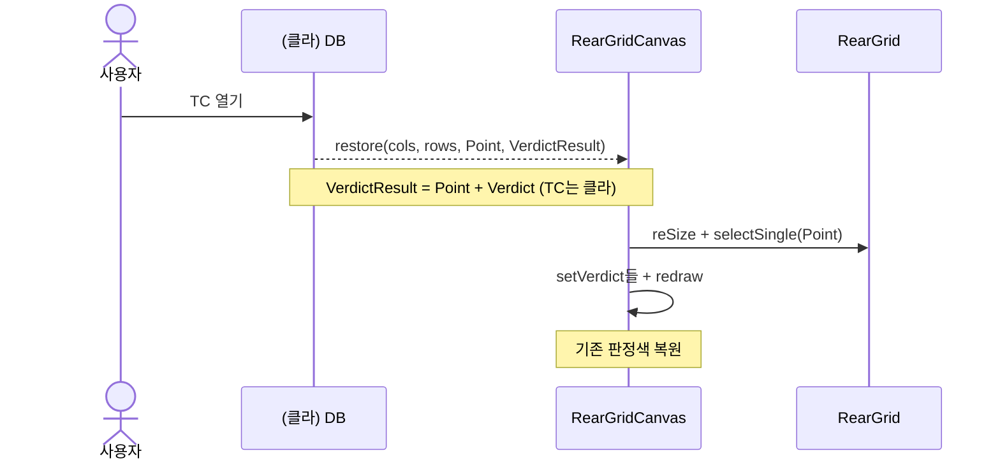
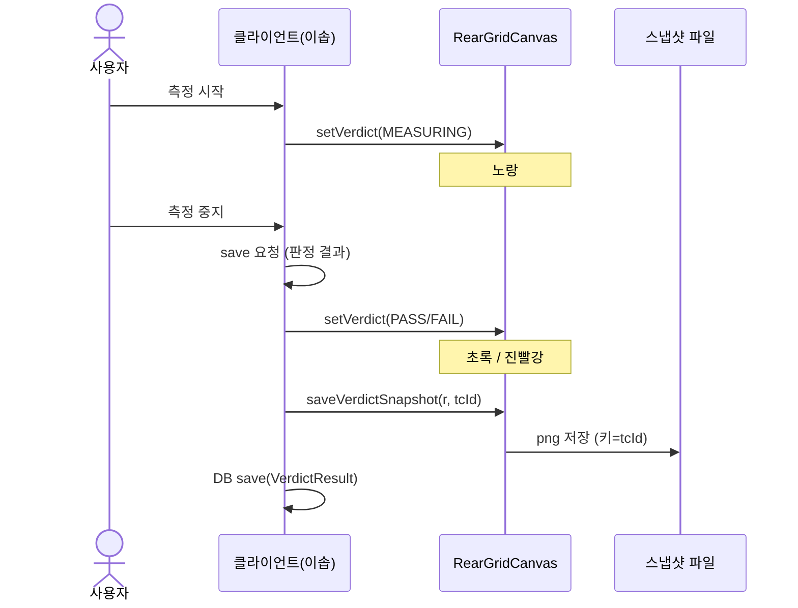
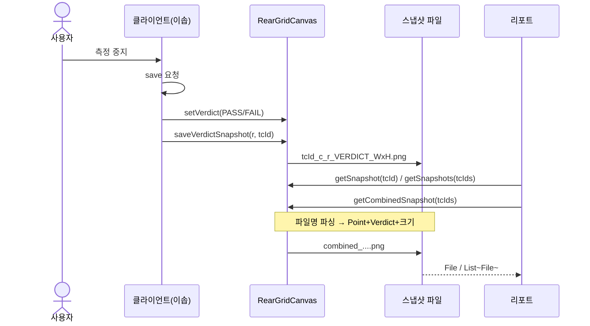

# 후방 검증 그리드 컴포넌트 - API 문서

차량 후방 검증 포인트 격자(차량 이미지 + 클릭 포인트 판)를 다른 RCP/SWT 제품에서 재사용하기 위한 컴포넌트 묶음.
**core(SWT無 데이터) + 위젯(SWT) + 선택적 컨트롤** 3계층으로 분리되어, 클라이언트가 조립 수준을 자유롭게 고른다.

> Notion 설계 원본: [R158 후방 검측 모듈 설계](https://www.notion.so/suresofttech/R158-39dbd7ce44718078a204e2ea88c73b14)

---

## 1. 구성 요소 (객체)

| 객체 | 역할 | 계층 |
|---|---|---|
| `java.awt.Point` | JDK 좌표. 규약: `x=col`, `y=row` | JDK |
| `RearGrid` | 격자 / 지정 포인트 **데이터**(SWT無 / DB無) | core |
| `Verdict` | 포인트 판정 상태 enum | core |
| `VerdictResult` | 포인트 판정 **결과 값 객체**(위치 + 판정). TC는 클라 영역 | core |
| `RearGridCanvas` | 차량 이미지 + 포인트 판 **그림 위젯** (extends Canvas) | ui.widget.settings.rear |
| `RearGridControlBar` | 가로 / 세로 + 격자 생성 / 지정해제 / 범례 (선택) | ui.widget |
| `RearGridPresetCombo` | 고정 크기 프리셋 콤보 (선택) | ui.widget |

---

## 2. 클래스 다이어그램



ASCII 대체:
```
              ┌─────────────────┐
              │     RearGrid     │  데이터(SWT無)
              │  크기 / 지정 / 저장   │
              └────────▲────────┘
                       │ holds
        ┌──────────────┴───────────────┐
        │        RearGridCanvas         │  그림 위젯(extends Canvas)
        │  그리기 / 클릭 / 판정색 / 복원 / 파일스냅샷 │───uses──▶ Verdict(enum)
        └───▲───────────────────────▲──┘
   controls │                       │ controls
 ┌──────────┴────────┐   ┌──────────┴──────────┐
 │ RearGridControlBar │   │ RearGridPresetCombo │  선택적 컨트롤
 │ apply / 해제 / 범례    │   │ 선택 즉시 setGrid   │
 └────────────────────┘   └─────────────────────┘
```
---

## 3. API 상세

### 3.1 `RearGrid` - 데이터 (core, SWT無 / DB無)
```
public RearGrid(int cols, int rows)          // cols×rows 격자 생성
public void reSize(int cols, int rows)       // 크기 변경(지정 전부 해제)
public int getCols() / int getRows()         // 현재 크기
public boolean isSelected(Point p)           // 셀 지정 여부 (p.x=col, p.y=row)
public void selectSingle(Point p)            // 포인트 지정(단일) / 복원 공용. 같은 셀 재호출 시 해제
public void clearAll()                       // 지정 전부 해제(크기 유지)
public Point getSelectedPoint()              // 지정 포인트. 없으면 null
```

### 3.2 `RearGridCanvas` - 그림 위젯 (extends Canvas)
```
public RearGridCanvas(Composite parent, RearGrid grid)
public RearGrid getGrid() / void setGrid(RearGrid g)
public void setVerdict(VerdictResult r)                  // 포인트 판정 반영(색칠)
public void clearVerdicts()                              // 판정색 초기화(지정 유지)
public VerdictResult getVerdict(Point p)                 // 포인트 1개 조회(없으면 null). 목록은 클라 보유
public void restore(int cols, int rows, Point point, VerdictResult verdict)
                                                         // 원샷 복원: 크기+지정+판정색(1개, null 가능)+redraw
public void redraw()
public void setShowLegend(boolean b)                     // 상태 범례 on/off(기본 on)

// ── 판정 스냅샷 = 파일 저장 + TC 이름으로 조회 ──
// 라이브 Image 재렌더 API(snapshot / snapshotOf)는 두지 않는다.
public void setSnapshotDir(File dir)                          // 저장 폴더 지정(없으면 임시폴더)
public File saveVerdictSnapshot(VerdictResult r, String tcId)  // 이솝 측정 중지→save 시 저장
    // 파일명(순서): <tcId>_c<col>_r<row>_<VERDICT>_<cols>x<rows>.png
    // 예: TC-003_c1_r1_PASS_4x6.png
public File getSnapshot(String tcId)                           // TC 1개 파일 조회
public List<File> getSnapshots(List<String> tcIds)             // TC 여러 개 → 개별 파일 목록
public File getCombinedSnapshot(List<String> tcIds)            // 통합 (파일명 메타 복원). 격자 크기 상이 시 미결(타일 vs 에러)
```

### 3.3 `Point` / `Verdict` / `VerdictResult` - 값 객체 (core, SWT無)
```
// 격자 좌표 = java.awt.Point (별도 클래스 없음). ★ x=col, y=row
import java.awt.Point;
Point p = new Point(col, row);   // p.x = col, p.y = row

public enum Verdict { NONE, MEASURING, PASS, FAIL }
// NONE=지정색(빨강) / MEASURING=노랑 / PASS=초록 / FAIL=진빨강(지정색과 구분)

public final class VerdictResult {
    public VerdictResult(int col, int row, Verdict verdict)
    public VerdictResult(Point p, Verdict verdict)
    public Point getPoint()   // x=col, y=row
    public Verdict getVerdict()
}
```

### 3.4 `RearGridControlBar` - 커스텀 크기 컨트롤 (선택)
> 스피너 / 버튼 UI를 내장. 공개 API는 최소만.

```
public RearGridControlBar(Composite parent, RearGridCanvas target)
public void apply()                    // 스피너 값 → setGrid
public void clearSelection()           // 지정 해제
public void setShowLegend(boolean on)  // 범례 on/off
```

### 3.5 `RearGridPresetCombo` - 고정 크기 프리셋 (선택)
> 콤보 선택 시 **즉시** `setGrid`. 추가 공개 API 없음.

```
public RearGridPresetCombo(Composite parent, RearGridCanvas target)
```

### 3.6 조립 예
```java
RearGridCanvas cv = new RearGridCanvas(parent, new RearGrid(9, 7));
new RearGridControlBar(toolbar, cv);   // 또는
new RearGridPresetCombo(toolbar, cv);
```

---

## 4. 사용자 시나리오

### S1. 새 TC 작성 → 저장
#### S1-a. 커스텀 크기 (`RearGridControlBar`)
1. 가로 / 세로 입력 → `apply()` → `setGrid(new RearGrid(cols, rows))`
2. 셀 클릭 → `selectSingle(new Point(c,r))`
3. 저장 → `getCols()` / `getRows()` / `getSelectedPoint()` → DB



#### S1-b. 프리셋 크기 (`RearGridPresetCombo`)
1. 콤보에서 `9×7` 등 선택 → (기본) 즉시 `setGrid`
2. 이후 S1-a의 2~3과 동일


### S2. 기존 TC 열기 → 복원
| 단계 | 동작 | API / 데이터 |
|---|---|---|
| 1 | TC 열기 | DB에서 `(cols, rows, Point, VerdictResult)` 조회. 판정 전이면 verdict=`null` |
| 2 | 화면 복원 | `restore(cols, rows, point, verdict)` → 격자 / 지정 + **기존 판정색** 재현 |



### S3. 검증 실행 → 판정 / 스냅샷 저장
새 측정이든 복원 후 이어서든 동일.
**트리거: 이솝「측정 중지」→ save 요청 → 스냅샷 저장.**

| 단계 | 동작 | API |
|---|---|---|
| 1 | 측정 시작 → 화면 노랑 | `setVerdict(new VerdictResult(point, MEASURING))` |
| 2 | 사용자 **측정 중지** (이솝 UI) | - |
| 3 | 이솝 **save 요청** (판정 결과 포함) | (이솝 내부) |
| 4 | 판정색 반영 (초록/진빨강) | `setVerdict(new VerdictResult(point, PASS\|FAIL))` |
| 5 | 판정 스냅샷 파일 저장 | `saveVerdictSnapshot(r, tcId)` |
| 6 | 이솝 DB에 결과 저장 | DB save(`VerdictResult`) |
| 7 | (재검증) 판정색만 초기화 후 1부터 | `clearVerdicts()` |



#### 규약 정의 내용 (보고서용 스냅샷)

1. **요청 API (조회)**
   - 단일 스냅샷 파일 조회: `getSnapshot(tcId)` → `File`
   - 다중 스냅샷 개별 파일 배치 조회: `getSnapshots(tcIds)` → `List<File>`
   - 다중 스냅샷 통합 파일 조회: `getCombinedSnapshot(tcIds)` → `File` 1개
   - 격자 크기가 다른 TC를 통합 파일로 조회할 경우 (미결 / 둘 중 택1)
     - 타일을 붙여서 통합
     - 동일 규격만 통합 가능하도록 에러 핸들링
     - *(현재 PoC 구현: 동일 규격만 합치고, 다른 크기 TC는 제외)*
2. **키 / 이름 명명**
   - 파일 키 = `tcId` (문자열). 이솝 TC ID/이름과 **동일**하게 맞춤.
   - 메타는 **고정 순서**로 붙임: `tcId` → `c` → `r` → `VERDICT` → `cols`x`rows`
   - 예: `TC-01.png` 키가 아니라
     `TC-003_c1_r1_PASS_4x6.png`
     (`_c` … `_r` … `_PASS|_FAIL|…` … `_4x6` 순서)
3. **파일 경로 / 이름**
   - 폴더: `setSnapshotDir(File)` (미지정 시 임시폴더)
   - 확장자: `.png` 고정
   - 통합 스냅샷 파일명 예: `combined_<tcId1>_<tcId2>.png`
4. **덮어쓰기**: 동일 `tcId`로 재저장 시 **기존 파일 덮어쓰기** (재검증 후 최신본 유지).

### S4. 재검증
- `clearVerdicts()` → 지정 유지, 판정색만 제거 → S3 다시

### S5. 클라이언트 자유 조립 (위젯만 임베드)
```java
RearGridCanvas cv = new RearGridCanvas(myPanel, new RearGrid(9,7));
myGenerateBtn.onClick(() -> cv.setGrid(new RearGrid(w, h)));
mySaveBtn.onClick(() -> db.save(cv.getGrid().getCols(),
                                cv.getGrid().getRows(),
                                cv.getGrid().getSelectedPoint()));
```

### S6. 판정 스냅샷 조회 (보고서)
- TC 1개 파일 → `getSnapshot("TC-01")`
- TC 여러 개 **개별 파일** → `getSnapshots(ids)` → `List<File>`
- TC 여러 개 **통합 이미지** → `getCombinedSnapshot(ids)` - 파일명에서 메타 복원

```java
VerdictResult r = new VerdictResult(new Point(3, 2), Verdict.PASS);
File f1 = cv.saveVerdictSnapshot(r, "TC-01");
// → TC-01_c3_r2_PASS_9x7.png

File again = cv.getSnapshot("TC-01");
List<File> each = cv.getSnapshots(Arrays.asList("TC-01", "TC-02"));
File combined = cv.getCombinedSnapshot(Arrays.asList("TC-01", "TC-02"));
```



---

## 5. 상태 2층 개념 (핵심)

셀 하나는 **독립된 두 층**을 가진다:

| 층 | 소유 | 의미 | 색 |
|---|---|---|---|
| 지정(selected) | `RearGrid` | 어느 포인트를 검증하나 | 빨강(지정) / 회색(미지정) |
| 판정(verdict) | `RearGridCanvas` (`VerdictResult` 보관) | 그 포인트 검증 결과 | 노랑/초록/진빨강 (NONE이면 지정색) |

렌더 우선순위: `verdict ≠ NONE` → 판정색 / 아니면 지정 여부 색.

저장 계약: `(cols, rows, Point, VerdictResult)` - 판정 전이면 verdict=`null`. TC id는 클라/DB.
스냅샷 이미지는 별도 파일(키=`tcId` 인자)로 관리.

---

## 6. 판정 스냅샷 = 파일 저장 + TC 이름으로 조회

라이브 Image 재렌더 API(`snapshot` / `snapshotOf`)는 **두지 않는다**.

이솝 **측정 중지 → save** 시점에 판정 스냅샷을 파일로 저장하고, 이후 TC 이름/ID로 파일을 꺼내 전달한다.

| 단계 | API | 결과 |
|---|---|---|
| 측정 중지 → save | `setVerdict` + `saveVerdictSnapshot(r, tcId)` | `tcId_c_r_VERDICT_WxH.png` |
| TC 1개 조회 | `getSnapshot(tcId)` | 해당 파일 |
| TC 여러 개 (개별) | `getSnapshots(tcIds)` | TC별 파일 목록 |
| TC 여러 개 (통합) | `getCombinedSnapshot(tcIds)` | 파일명 메타로 통합 이미지 |
| 표 / 복원 데이터 | 클라 보유 `VerdictResult` | TC 복원용 (스냅샷과 별개) |

> 개별 ≈ **tcId 접두사로 파일 조회** / 통합 ≈ **파일명에서 Point / Verdict / 크기 파싱 후 재렌더**.

---

## 7. 경계 (책임 구분)

| 우리(라이브러리) | 클라이언트 |
|---|---|
| 격자 데이터 / 그리기 / 클릭 / 판정색 / 복원 | **DB 저장/조회** |
| 스냅샷 파일 저장 / TC 키 조회 | UI 배치 / 버튼 / 판정 엔진 연결 |
| `(cols, rows, Point, VerdictResult)` 입출력 계약 | TC id ↔ 파일 경로 정책(필요 시) |

> DB / 판정 엔진 / 화면 배치는 클라이언트 영역. 라이브러리는 데이터 모델과 그림 위젯(+스냅샷 파일 헬퍼)을 제공한다.

---

## 8. 판정별 화면 설계 & 범례

### 8.1 색 매핑 (렌더 우선순위)

| 우선 | 조건 | 색 | 크기 |
|---|---|---|---|
| 1 | verdict = PASS | 초록 (40,170,70) | 큰 점 |
| 2 | verdict = FAIL | 진빨강 (150,20,20) | 큰 점 |
| 3 | verdict = MEASURING | 노랑 (230,200,40) | 큰 점 |
| 4 | 지정(selected) | 빨강 (210,55,55) | 큰 점 |
| 5 | 그 외 | 회색 (220,220,224) | 작은 점 |

### 8.2 화면 목업 (판정 진행)
```
측정 전                측정 중                결과
┌ 범례 ┐              ┌ 범례 ┐              ┌ 범례 ┐
│○미지정│  🚗 / ● / │○미지정│  🚗 / ◍ / │○미지정│  🚗 / ● /
│●지정  │ /  /  / │◍측정중│ /  /  / │●지정  │ / ○ /
│◍측정중│ /  /  / │        ...          │◍측정중│
│●PASS │              (● 지정 → ◍ 노랑)      │●PASS │  (◍ → ● 초록)
│●FAIL │                                    │●FAIL │
└──────┘                                    └──────┘
```

### 8.3 범례 (Legend)
- 좌상단 고정 박스. **색 ↔ 의미**(미지정/지정/측정중/PASS/FAIL) 표시.
- `setShowLegend(boolean)` 로 on/off (기본 on).

---

## 9. 사용자 Action 목록

| Action | 트리거 | 관련 API | 결과 |
|---|---|---|---|
| 격자 크기(커스텀) | ControlBar 생성 버튼 | `ControlBar.apply()` → `setGrid` | 새 격자(지정 / 판정 초기화) |
| 격자 크기(프리셋) | PresetCombo 선택 | `PresetCombo` → `setGrid` | 고정 크기 격자 |
| 포인트 지정 | 셀 클릭 | `selectSingle(Point)` | 빨강 지정, 재클릭 해제 |
| 지정 해제 | ControlBar / 버튼 | `ControlBar.clearSelection()` → `clearAll`+`redraw` | 지정 전부 해제 |
| 차량 그림 교체 | 클라 코드 | `canvas.setCarImage(Image)` | 배경 이미지 변경 |
| 검증 시작 | 측정 시작 | `setVerdict(MEASURING)` | 해당 포인트 노랑 |
| 판정 반영 | 엔진 결과 | `setVerdict(PASS/FAIL)` | 초록 / 진빨강 |
| 스냅샷 파일 저장 | 이솝 측정 중지 → save | `saveVerdictSnapshot(r, tcId)` | TC 키로 파일 저장 |
| 재검증 | 다시 측정 | `clearVerdicts` | 판정색만 초기화 |
| 범례 토글 | ControlBar 체크 / 코드 | `ControlBar.setShowLegend` / `canvas.setShowLegend` | 범례 표시/숨김 |
| 저장 | 저장 버튼 | `getCols/getRows/getSelectedPoint` + 클라 `VerdictResult` → DB | 크기+점+판정(없으면 null) |
| 불러오기 | TC 열기 | `restore(cols, rows, Point, verdict)` | 격자 / 지정 / 판정색 복원 |
| TC 1개 스냅샷 | 보고서 | `getSnapshot(tcId)` | 해당 파일 |
| TC 여러 개 (개별) | 보고서 | `getSnapshots(tcIds)` | TC별 파일 목록 |
| TC 여러 개 (통합) | 보고서 | `getCombinedSnapshot(tcIds)` | 파일명 메타로 통합 |

### API 목록 (객체별)

#### `java.awt.Point` (JDK)
| API | 설명 |
|---|---|
| `Point(int x, int y)` | 격자 좌표. **규약: `x=col`, `y=row`** |
| `x` / `y` | 열 / 행 |

#### `Verdict` (core)
| API | 설명 |
|---|---|
| `NONE` | 판정 없음 → 지정색(빨강) 또는 미지정(회색) |
| `MEASURING` | 측정 중 → 노랑 |
| `PASS` | 합격 → 초록 |
| `FAIL` | 불합격 → 진빨강 |

#### `VerdictResult` (core)
| API | 설명 |
|---|---|
| `VerdictResult(int col, int row, Verdict)` | 위치+판정 생성 |
| `VerdictResult(Point p, Verdict)` | Point 편의 생성자 |
| `getPoint()` | 위치 (`x=col`, `y=row`) |
| `getVerdict()` | 판정 enum. TC id는 포함하지 않음 |

#### `RearGrid` (core)
| API | 설명 |
|---|---|
| `RearGrid(int cols, int rows)` | cols×rows 격자 생성 |
| `reSize(int cols, int rows)` | 크기 변경(지정 전부 해제) |
| `getCols()` / `getRows()` | 현재 가로 / 세로 점 개수 |
| `isSelected(Point p)` | 해당 셀 지정 여부 |
| `selectSingle(Point p)` | 단일 포인트 지정/토글 |
| `clearAll()` | 지정 전부 해제(크기 유지) |
| `getSelectedPoint()` | 지정 포인트. 없으면 `null` |

#### `RearGridCanvas` (ui)
| API | 설명 |
|---|---|
| `RearGridCanvas(Composite, RearGrid)` | 그림 위젯 생성 |
| `getGrid()` / `setGrid(RearGrid)` | 격자 모델 조회 / 교체 |
| `setVerdict(VerdictResult)` | 판정색 반영 |
| `clearVerdicts()` | 판정색만 초기화(지정 유지) |
| `getVerdict(Point)` | 셀 판정 단건 조회. 없으면 `null` |
| `restore(cols, rows, Point, VerdictResult)` | 크기+지정+판정 원샷 복원 |
| `setShowLegend(boolean)` | 범례 on/off |
| `setSnapshotDir(File)` | 스냅샷 저장 폴더 |
| `saveVerdictSnapshot(r, tcId)` | 측정 중지→save 시 png 저장 |
| `getSnapshot(tcId)` | TC 1개 스냅샷 파일 |
| `getSnapshots(tcIds)` | TC 여러 개 개별 파일 목록 |
| `getCombinedSnapshot(tcIds)` | 통합 이미지(파일명 메타 복원) |
| `redraw()` | 다시 그리기 |
| `setCarImage(Image)` | 차량 후방 배경 이미지 |

#### `RearGridControlBar` (ui, 선택)
| API | 설명 |
|---|---|
| `RearGridControlBar(Composite, RearGridCanvas)` | 컨트롤바 생성 |
| `apply()` | 스피너 → 격자 생성 |
| `clearSelection()` | 지정 해제 |
| `setShowLegend(boolean)` | 범례 on/off |

#### `RearGridPresetCombo` (ui, 선택)
| API | 설명 |
|---|---|
| `RearGridPresetCombo(Composite, RearGridCanvas)` | 프리셋 콤보. **선택 즉시** `setGrid` |

---

## 10. 패키지 활용법

### 10.1 패키지 구성
```
com.suresofttech.apx.core.rear     (SWT無)  : RearGrid, Verdict, VerdictResult  (좌표는 java.awt.Point)
com.suresofttech.apx.ui.widget.settings.rear (SWT) : RearGridCanvas
com.suresofttech.apx.ui.widget     (SWT)    : RearGridControlBar, RearGridPresetCombo, RearGridPanel
```

### 10.2 의존성
- **core**: 순수 Java(외부 의존 없음). 어떤 제품에서도 사용.
- **ui.widget**: SWT/JFace 필요(RCP 기본 제공). OpenCV / 기타 무관.

### 10.3 포함 방법
- **Eclipse 플러그인 클라이언트**: `com.suresofttech.apx.core`, `com.suresofttech.apx.ui` 를 의존(Require-Bundle)에 추가.
- **일반 SWT 앱**: 두 프로젝트를 jar로 빌드해 클래스패스에 추가.

### 10.4 최소 사용 (복붙 시작점)
```java
// 1) 위젯 심기
RearGrid grid = new RearGrid(9, 7);
RearGridCanvas canvas = new RearGridCanvas(parent, grid);
canvas.setLayoutData(new GridData(SWT.FILL, SWT.FILL, true, true));

// 2) 판정 반영 + 스냅샷 파일 저장
VerdictResult r = new VerdictResult(3, 2, Verdict.PASS);
canvas.setVerdict(r);
File snap = canvas.saveVerdictSnapshot(r, "TC-01");

// 3) 저장 / 복원 - 판정은 클라가 보유 (없으면 null)
Point p = grid.getSelectedPoint();
VerdictResult verdict = myVerdict; // 클라 쪽 (없으면 null)
canvas.restore(grid.getCols(), grid.getRows(), p, verdict);

// 4) 보고서 - TC 이름으로 파일 조회
File again = canvas.getSnapshot("TC-01");

// 5) 선택적 컨트롤
new RearGridControlBar(toolbar, canvas);  // apply / clearSelection / 범례
// 또는 new RearGridPresetCombo(toolbar, canvas);  // 선택 즉시 setGrid
```

---

## 11. 구현 현황

| 항목 | 상태 |
|---|---|
| `Verdict`, `VerdictResult` (core) / 좌표 `java.awt.Point`(x=col,y=row) | ✅ / 설계 확정 |
| `RearGrid.getSelectedPoint()` / `selectSingle(Point)` / `isSelected(Point)` | ✅ / 설계 확정 |
| `RearGridCanvas` 판정색(`setVerdict`/`clearVerdicts`/`getVerdict`) | ✅ |
| `getVerdict(Point)` (단건) | ✅ / 설계 확정 |
| `getVerdicts()` / `groupByVerdict()` | ❌ 제거 (판정 목록은 클라 보유) |
| `restore(cols, rows, Point, VerdictResult)` (판정색 포함, null 가능) | ⏳ 설계 반영 |
| `saveVerdictSnapshot` / `getSnapshot` / `getSnapshots` (파일명 메타 인코딩) | ✅ |
| `getCombinedSnapshot(tcIds)` (파일명 파싱 통합, DB 불필요) | ✅ |
| `getCombinedSnapshot(cols, rows, Map)` | ❌ 제거 (파일명 자가기술로 대체) |
| `getSnapshots(tcIds, combined)` boolean 오버로드 | ❌ 제거 |
| `snapshot()` / `snapshotOf` / `applyVerdicts` | ❌ 제거 (파일 모델로 대체) |
| `RearGridControlBar` (`apply` / `clearSelection` / `setShowLegend`) | ✅ 구현 |
| `RearGridPresetCombo` (생성자만, 선택 즉시 setGrid) | ✅ 구현 |
| 현재 `RearGridPanel` 인라인 컨트롤 | ✅ PoC (추후 ControlBar/PresetCombo로 교체 가능) |
