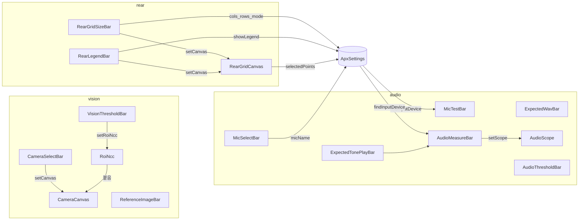

# 설정 UI 단위 컴포넌트

이솝이 원하는 조각만 골라 배치한다. 공유 값은 `ApxSettings.get()` 싱글턴.
조립은 **View에서 최소 단위를 직접 붙인다**.

## 모듈화 설계



## 패키지 구조

```
com.suresofttech.apx.ui.widget.settings/
├── vision/
│   ├── CameraSelectBar, CameraCanvas, RoiNcc
│   ├── ReferenceImageBar, VisionThresholdBar
├── audio/
│   ├── MicSelectBar, MicTestBar, AudioScope
│   ├── ExpectedWavBar, AudioMeasureBar, ExpectedTonePlayBar
│   └── AudioThresholdBar
└── rear/
    └── RearGridSizeBar, RearLegendBar, RearGridCanvas
```

독립 미리보기: `tools/apx-settings-demo/run-demo.bat` (권장) / `데모실행.bat`
조립 예: `SettingsClientView` / `SettingsClientView2`

## 최소 단위

### vision

| 클래스 | 내용 |
|--------|------|
| `CameraSelectBar` | 웹캠 콤보 → `setCanvas(CameraCanvas)` |
| `CameraCanvas` | 웹캠 화면 |
| `RoiNcc` | ROI/NCC - 캔버스에 붙음 (`Style` 옵션) |
| `ReferenceImageBar` | 기준 이미지 (옵션) |
| `VisionThresholdBar` | NCC 임계 → `setRoiNcc` (`Cfg` 옵션) |

### audio

| 클래스 | 내용 |
|--------|------|
| `MicSelectBar` | 마이크 콤보 → `ApxSettings.setMicName` |
| `MicTestBar` | 입력 레벨 + 테스트 (`AudioCapture.findInputDevice`) |
| `ExpectedWavBar` | 기대 wav 경로 (`Cfg` 옵션) |
| `AudioMeasureBar` | 측정/초기화 → `setScope(AudioScope)` (`Cfg` 옵션) |
| `AudioScope` | 파형 표시 |
| `ExpectedTonePlayBar` | 기대음 재생 - 보통 `measure.getActionRow()`에 붙임 |
| `AudioThresholdBar` | 주파수 / 파형 임계 (`Cfg` 옵션) |

### rear

| 클래스 | 내용 |
|--------|------|
| `RearGridSizeBar` | 프리셋/커스텀 크기 → `ApxSettings` + `setCanvas` (`Cfg`로 라디오 문구 등). 모드별 편집 UI는 같은 자리에 하나만 표시 |
| `RearLegendBar` | 범례 체크 → `ApxSettings` + `legend.setCanvas(canvas)` |
| `RearGridCanvas` | 차량 + 격자 Select (+ `setShowLegend`) |

`ApxSettings` 후방 필드: `rearCols`/`rearRows`, `rearSizeMode` (`preset`\|`custom`), `rearShowLegend`, `rearSelectedPoints`. 크기 변경 시 Select는 초기화.

패널 조립은 UI에 두지 않고 **Client View에서 최소 단위를 직접 붙인다**.

## 사용 예 (`SettingsClientView` 조립)

```java
CameraSelectBar cam = new CameraSelectBar(webcam);
CameraCanvas canvas = new CameraCanvas(webcam);
cam.setCanvas(canvas);
RoiNcc roi = new RoiNcc(canvas);
VisionThresholdBar vThr = new VisionThresholdBar(refBlock);
vThr.setRoiNcc(roi);

MicSelectBar mic = new MicSelectBar(micGroup);
new MicTestBar(micGroup); // ApxSettings micName 사용

new ExpectedWavBar(expected);
AudioMeasureBar measure = new AudioMeasureBar(expected);
new ExpectedTonePlayBar(measure.getActionRow());
AudioScope scope = new AudioScope(expected, 5000.0);
measure.setScope(scope);
new AudioThresholdBar(expected);

// 후방 - Client에서 최소 단위 직접 조립
RearGridSizeBar size = new RearGridSizeBar(rearGroup);
RearLegendBar legend = new RearLegendBar(rearGroup);
RearGrid g = new RearGrid(s.getRearCols(), s.getRearRows());
g.selectPoints(s.getRearSelectedPoints());
RearGridCanvas rCanvas = new RearGridCanvas(rearGroup, g);
rCanvas.loadDefaultCarImage();
size.setCanvas(rCanvas);
legend.setCanvas(rCanvas);
```

## 설정 vs 측정 모니터

| | 설정 View | 측정 모니터 View |
|--|-----------|------------------|
| 목적 | `ApxSettings` 편집 | Kickoff 세션의 **시작 스냅샷**으로 고정 표시 / 판정 |
| 조립 | Mic/Wav/ROI/격자 등 최소 단위 + 편집 바 | `AudioScope` / `CameraCanvas`+`RoiNcc(interactive=false)` / `RearGridCanvas(interactive=false)` |
| 엔진 | 설정 탭 단독 측정(AudioMeasureBar 등) | core `MeasureSession` + Client `KickoffView` (전체 PASS 시 후방 자동 PASS / 증거 저장) |

측정 레이아웃: `KickoffView` + `AudioMonitorView` / `VisionMonitorView` / `RearMonitorView` (`ClientPerspective`).
