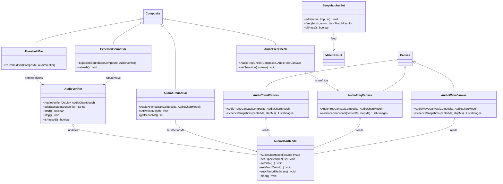
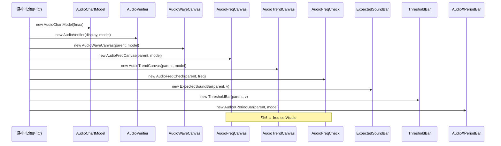
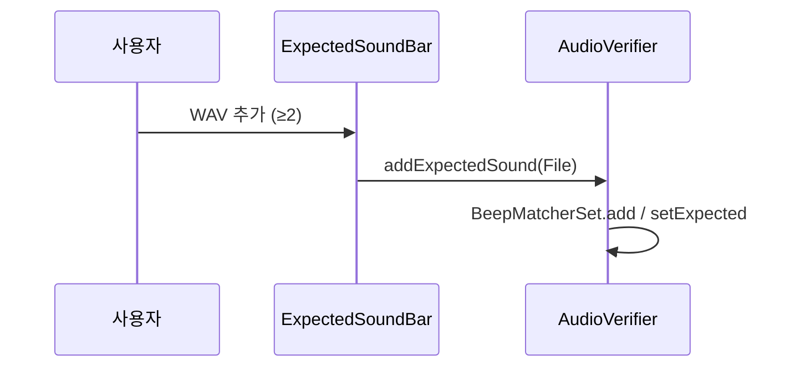
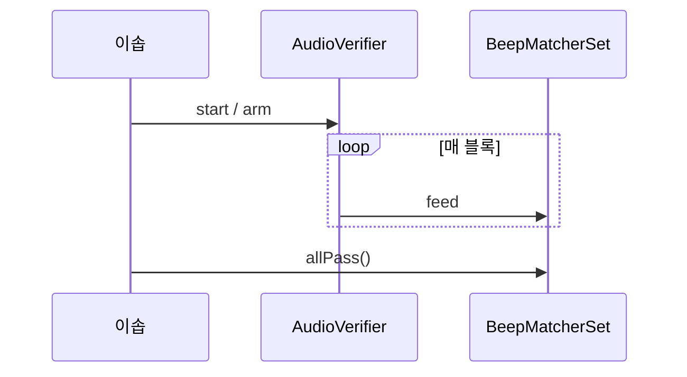
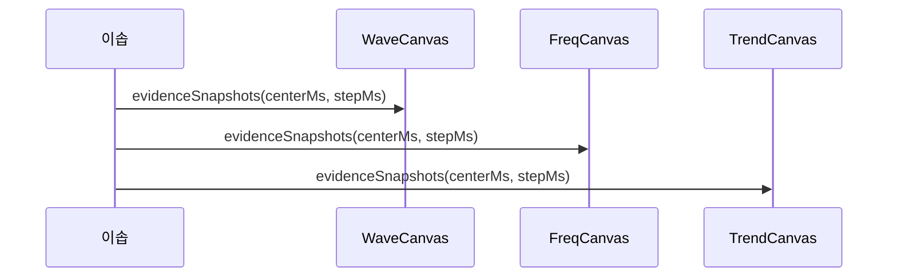
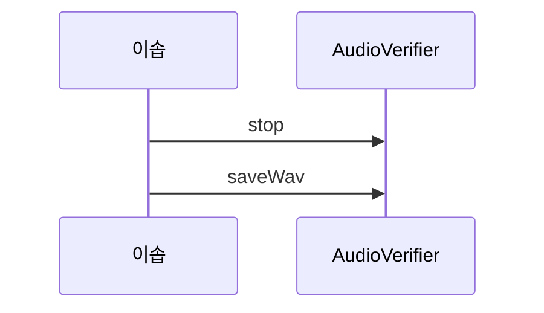

# 음향 검측 모듈 — API 문서

기대 beep(근접 경고음) 일치 검증을 RCP/SWT 제품에서 재사용하기 위한 컴포넌트 묶음.
**core(SWT無 엔진) + 모니터 위젯 4종(ChartDirector) + 기대음·임계 UI + AudioVerifier(선택)**

> Notion 설계 원본: [R158 음향 검측 모듈 설계](https://www.notion.so/suresofttech/R158-3a6bd7ce447180dd9347f5e6cbbf9efd)

---

## 1. 구성 요소 (객체)

| 객체 | 역할 | 계층 |
|---|---|---|
| `BeepMatcherSet` | 기대음 **≥2** · **측정**(`feed`) · **`allPass()`(AND)** | core.audio |
| `MatchResult` | 템플릿 1건 측정 점수(freq/wave/isPass) | core.audio |
| `AudioCapture` | 마이크 캡처. 장치 UI는 설정 탭 | core.audio |
| `AudioRecorder` | 측정 시작~종료 원본 · 구간 추출 | core.audio |
| `WavIo` / `Wav` | WAV 로드 / 저장 / 구간 저장 | core.audio |
| `AudioChartModel` | 파형·주파수·추이 **공유 데이터** (SWT無에 가깝게 갱신 API) | ui.widget |
| `AudioWaveCanvas` | **① 파형** 모니터 · `evidenceSnapshots` (before=3, after=3 고정) | ui.widget |
| `AudioFreqCanvas` | **② 주파수** 모니터 · `evidenceSnapshots` (before=3, after=3 고정) | ui.widget |
| `AudioTrendCanvas` | **③ 추이도** 모니터 · `evidenceSnapshots` (before=3, after=3 고정) | ui.widget |
| `AudioFreqCheck` | **④ 주파수 모니터 보기** 체크박스 (단독 API) | ui.widget |
| `ExpectedSoundBar` | **⑤ 기대음 입력 UI (단일 API)** — 추가·목록·삭제로 ≥2 등록 | ui.widget |
| `ThresholdBar` | **⑥ PASS 임계 UI** (freq/wave) — 모듈 제공 | ui.widget |
| `AudioXPeriodBar` | **⑦ 그래프 X축 주기(시간창) 선택 UI** — 모듈 제공 | ui.widget |
| `AudioVerifier` | 캡처+매칭+녹음+모델 갱신 파이프라인 (선택) | ui.widget |

> 모니터·기대음·임계 UI는 **각각 별도 API**. 이솝은 배치만. (묶음 `AudioMonitor` 아님)

---

## 2. 클래스 다이어그램



---

## 3. API 상세

### 3.1 모니터 위젯 (각각 독립 · ChartDirector)

이솝이 **필요한 것만** 골라 배치한다.

| # | 클래스 | API | 역할 |
|---|---|---|---|
| 1 | `AudioWaveCanvas` | `new …` · **`evidenceSnapshots(centerMs, stepMs)`** | 파형 + 증거 ±3 |
| 2 | `AudioFreqCanvas` | `new …` · **`evidenceSnapshots(centerMs, stepMs)`** | 주파수 + 증거 ±3 |
| 3 | `AudioTrendCanvas` | `new …` · **`evidenceSnapshots(centerMs, stepMs)`** | 추이 + 증거 ±3 |
| 4 | `AudioFreqCheck` | `new AudioFreqCheck(parent, freqCanvas)` | 주파수 모니터 보기 on/off |
| 5 | `ExpectedSoundBar` | `new ExpectedSoundBar(parent, verifier)` | **기대음 입력 단일 UI** (슬롯별 API 없음) |
| 6 | `ThresholdBar` | `new ThresholdBar(parent, verifier)` | freq/wave PASS 임계 |
| 7 | `AudioXPeriodBar` | `new AudioXPeriodBar(parent, model)` | **X축 주기(시간창) 선택** |

```
AudioChartModel model = new AudioChartModel(5000);
AudioVerifier v = new AudioVerifier(display, model);

AudioWaveCanvas wave = new AudioWaveCanvas(parent, model);
AudioFreqCanvas freq = new AudioFreqCanvas(parent, model);
AudioTrendCanvas trend = new AudioTrendCanvas(parent, model);
new AudioFreqCheck(bar, freq);
new ExpectedSoundBar(bar, v);
new ThresholdBar(bar, v);
new AudioXPeriodBar(bar, model);  // ⑦ X축 주기
```

- `AudioFreqCheck`: 선택 시 `freqCanvas` 표시, 해제 시 숨김
- `ExpectedSoundBar`: **기대음 입력은 이 API 하나**. 사용자가 여러 번 추가로 ≥2 등록  
  - 수신 경로: 사용자 WAV 선택 → `ExpectedSoundBar` → `verifier.addExpectedSound(File)` → `BeepMatcherSet.add` + `model.setExpected`  
  - 이솝은 **배치만** 하면 됨. (선택) TC에서 `verifier.addExpectedSound` 직접 호출도 가능
- `ThresholdBar`: 스피너 → `verifier.setThresholds`
- `AudioXPeriodBar` / `model.setXPeriodMs(ms)`: **파형·추이** 시간축에 보일 구간(주기). 예: 100ms / 500ms / 1s / 2s …  
  - 주파수 그래프 X축은 Hz라서 **주파수 축에는 미적용** (표시 창만 파형·추이)
- **증거**: `evidenceSnapshots(centerMs, stepMs)` — before/after=3 고정, **stepMs=클라이언트**

### 3.2 `BeepMatcherSet` — 래치 · AND (순서 강제 없음)

기대음 ≥2 등록 시 템플릿마다 **독립 래치**:

1. 매 블록을 **모든** 템플릿에 `feed`
2. 어떤 템플릿이 `isPass`면 그 슬롯 `latched[i]` ON → **측정 끝까지 유지**
3. 순차 검출 OK (예: 삐 → 다른 음). **동시·순서 강제 없음**
4. `allPass()` = **전부** 래치 ON일 때만 true (AND)

이솝 판정 API:

```
BeepMatcherSet set = verifier.getMatcherSet();
set.allPass();   // 최종 PASS (둘 다 검출)
set.pending();   // 미검출 이름 (진행 표시)
set.anyPass();   // 하나라도 검출 (참고·OR)
```

### 3.3 `AudioRecorder` / `WavIo` / `AudioCapture`

(기존과 동일)

---

## 4. 사용자 시나리오

### S1. UI 배치 (이솝)

| 단계 | 동작 | API |
|---|---|---|
| 1 | 공유 모델 생성 | `new AudioChartModel(fmax)` |
| 2 | Verifier 생성 | `new AudioVerifier(display, model)` |
| 3 | 파형 그래프 배치 | `new AudioWaveCanvas(parent, model)` |
| 4 | 주파수 그래프 배치 | `new AudioFreqCanvas(parent, model)` |
| 5 | 추이 그래프 배치 | `new AudioTrendCanvas(parent, model)` |
| 6 | 주파수 보기 체크 배치 | `new AudioFreqCheck(parent, freqCanvas)` |
| 7 | 기대음 등록 UI 배치 | `new ExpectedSoundBar(parent, verifier)` |
| 8 | 임계 UI 배치 | `new ThresholdBar(parent, verifier)` |
| 9 | X축 주기 UI 배치 | `new AudioXPeriodBar(parent, model)` |



규약: 모니터 3종 + FreqCheck + ExpectedSoundBar + ThresholdBar + XPeriodBar + Verifier. ChartDirector는 납품 묶음 포함.

### S2. 기대음 등록

| 단계 | 동작 | API |
|---|---|---|
| 1 | 사용자 WAV 추가 (≥2) | `ExpectedSoundBar` |
| 2 | Verifier 등록 | `addExpectedSound(File)` |
| 3 | 매칭 세트·오버레이 | `BeepMatcherSet.add` · `setExpected` |



규약: 이솝은 바 배치만. (선택) TC에서 `addExpectedSound` 직접 호출 가능. 기대음 ≥2.

### S3. 측정 → PASS

| 단계 | 동작 | API |
|---|---|---|
| 1 | 측정 시작 | `arm` / `verifier.start` |
| 2 | 블록 측정 | `feed` |
| 3 | PASS (AND) | `allPass()` |



규약: 래치 · `allPass()`=AND · 순서 강제 없음. (모니터 갱신은 내부 `setData` — 스냅샷 아님)

### S4. 증거 스냅샷

| 단계 | 동작 | API |
|---|---|---|
| 1 | 파형 ±3 | `wave.evidenceSnapshots(centerMs, stepMs)` |
| 2 | 주파수 ±3 | `freq.evidenceSnapshots(centerMs, stepMs)` |
| 3 | 추이 ±3 | `trend.evidenceSnapshots(centerMs, stepMs)` |



규약: before=3, after=3 고정 · `stepMs`=클라이언트 · 단건 `snapshot()` 없음

### S5. 중지 · WAV

| 단계 | 동작 | API |
|---|---|---|
| 1 | 측정 중지 | `stop` |
| 2 | WAV 저장 | `saveWav` |



규약: WAV=`AudioRecorder`

---

## 5. 사용자 Action 목록

| Action | 주체 | 호출 API | 화면/데이터 결과 |
|---|---|---|---|
| 파형 모니터 배치 | 이솝 | `new AudioWaveCanvas(parent, model)` | 파형 그래프 |
| 주파수 모니터 배치 | 이솝 | `new AudioFreqCanvas(parent, model)` | 주파수 그래프 |
| 추이 모니터 배치 | 이솝 | `new AudioTrendCanvas(parent, model)` | 추이도 그래프 |
| 주파수 보기 체크 | 이솝/사용자 | `new AudioFreqCheck(parent, freq)` | 주파수 on/off |
| 기대음 등록 UI 배치 | 이솝 | `new ExpectedSoundBar(parent, verifier)` | 추가·목록·삭제 |
| 기대음 추가/삭제 | 사용자 | (ExpectedSoundBar) → `addExpectedSound` / `remove` | ≥2 |
| 임계 UI 배치 | 이솝 | `new ThresholdBar(parent, verifier)` | freq/wave 스피너 |
| 임계 조절 | 사용자 | (ThresholdBar) → `setThresholds` | 공통 임계 |
| X축 주기 UI 배치 | 이솝 | `new AudioXPeriodBar(parent, model)` | 시간창 선택 |
| X축 주기 변경 | 사용자/이솝 | `setXPeriodMs` / AudioXPeriodBar | 파형·추이 X축 |
| 측정·PASS | 이솝 | `feed` / `allPass` | 판정 |
| 증거 스냅샷 | 이솝 | `evidenceSnapshots(centerMs, stepMs)` ×3 | ±3×3 |
| 중지·WAV | 이솝 | `stop` / `saveWav` | 파일 |

---

## 6. 패키지 활용법

| 계층 | 패키지 | 포함 |
|---|---|---|
| core | `com.suresofttech.apx.core.audio` | `BeepMatcherSet`, `MatchResult`, `AudioCapture`, `AudioRecorder`, `WavIo` |
| ui | `com.suresofttech.apx.ui.widget` | `AudioChartModel`, `AudioWaveCanvas`, `AudioFreqCanvas`, `AudioTrendCanvas`, `AudioFreqCheck`, `ExpectedSoundBar`, `ThresholdBar`, `AudioXPeriodBar`, `AudioVerifier` |

```
Require-Bundle: ..., ChartDirector, com.suresofttech.apx.core
# ChartDirector 플러그인은 모듈 납품 묶음에 포함
```

```java
AudioChartModel model = new AudioChartModel(5000);
AudioVerifier v = new AudioVerifier(display, model);
AudioWaveCanvas wave = new AudioWaveCanvas(parent, model);
AudioFreqCanvas freq = new AudioFreqCanvas(parent, model);
AudioTrendCanvas trend = new AudioTrendCanvas(parent, model);
new AudioFreqCheck(bar, freq);
new ExpectedSoundBar(bar, v);  // 기대음 ≥2 UI
new ThresholdBar(bar, v);      // 임계 UI
new AudioXPeriodBar(bar, model); // X축 주기
v.start();
```

---

## 7. 화면설계 구상

모듈 제공 (각각 독립 API):
1. **파형** — `AudioWaveCanvas`
2. **주파수** — `AudioFreqCanvas`
3. **추이도** — `AudioTrendCanvas`
4. **주파수 모니터 보기** — `AudioFreqCheck`
5. **기대음 등록** — `ExpectedSoundBar` (≥2)
6. **PASS 임계** — `ThresholdBar`
7. **X축 주기(시간창)** — `AudioXPeriodBar`

이솝:
8. 위 위젯 배치·레이아웃 · 측정 시작/중지 · PASS/FAIL UX
9. `evidenceSnapshots(centerMs, stepMs)` · WAV · (설정) 마이크

---

## 8. 구현 현황

| 항목 | 상태 |
|---|---|
| ①②③④ 모니터 분리 API | ✅ 설계 확정 (코드 미반영) |
| ⑤ `ExpectedSoundBar` · ⑥ `ThresholdBar` | ✅ 설계 확정 (`ThresholdBar` 코드 ✅) |
| ChartDirector 렌더 (현 `AudioScope`/`AudioMonitor`) | ✅ 기존 PoC |
| `BeepMatcherSet` · `allPass`(AND) | ✅ |
| 묶음 `AudioMonitor` | ❌ 제공 안 함 |
